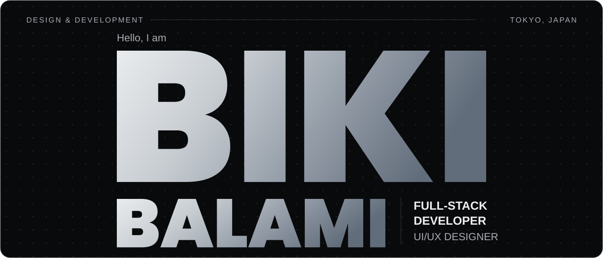
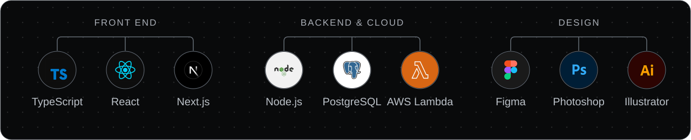
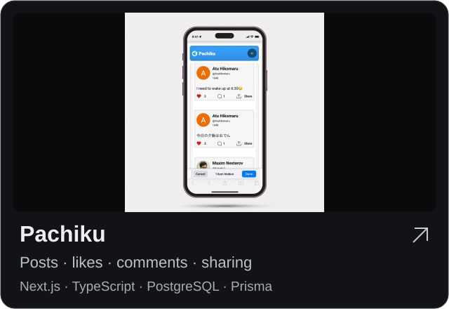
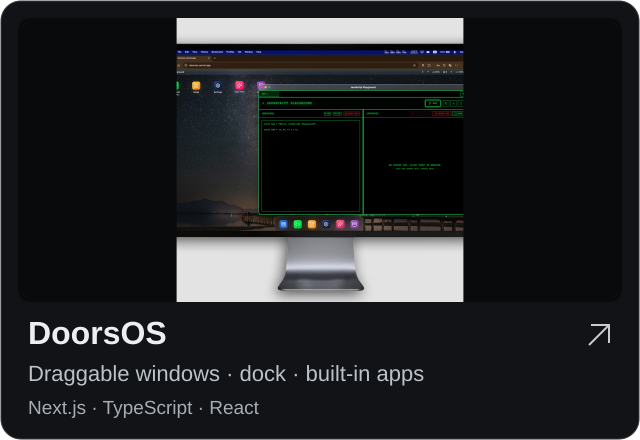

<a href="https://bikibalami.netlify.app/">
  <picture>
    <source media="(max-width: 600px)" srcset="assets/hero-mobile.svg">
    
  </picture>
</a>

  
  
  

Full-stack developer with a stronger focus on the front end. I work on two startup products at **Ukudala** and teach programming at **Tokyo Coding Club**.

My work includes frontend architecture, reusable design systems, typed API integration, Storybook, Playwright, and AWS backend functions. I also work in UI/UX, graphic design, and art.

### Development & design

<picture>
  <source media="(max-width: 600px)" srcset="assets/skills-mobile.svg">
  
</picture>

### Projects

  
  

[Pachiku source](https://github.com/BikiBalami99/Pachiku) · [Experience, projects & artwork](https://bikibalami.netlify.app/)
